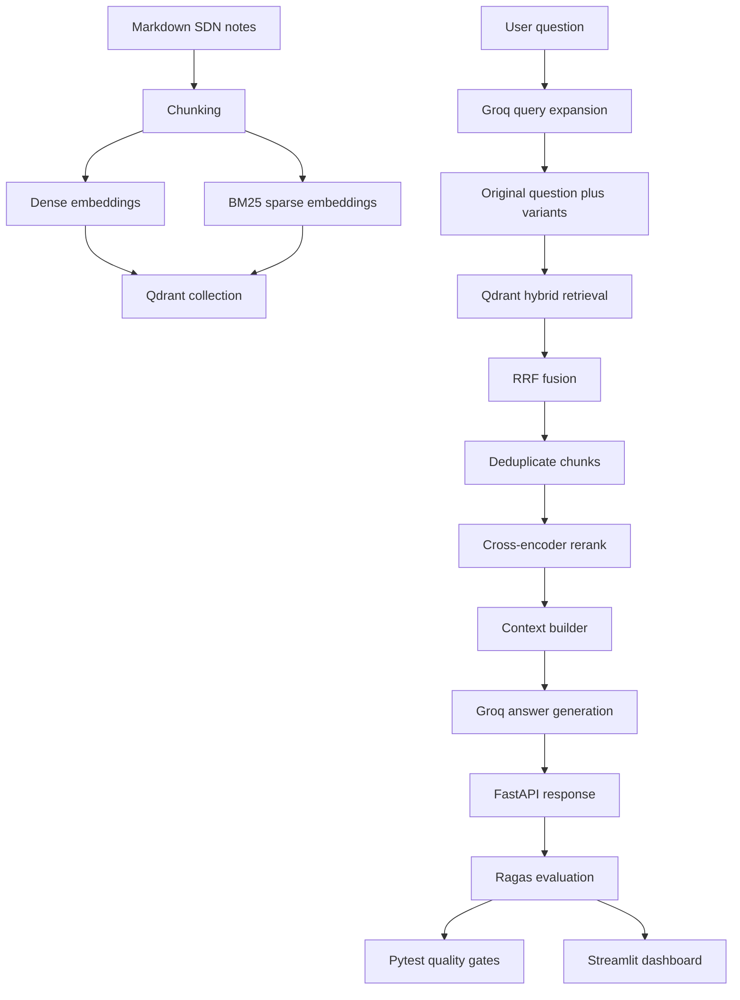

# RAG Lab

RAG Lab is a retrieval-augmented generation project for answering questions over Software-Defined Networking (SDN) study notes. It implements a practical RAG pipeline with hybrid retrieval, multi-query expansion, cross-encoder reranking, grounded answer generation, API serving, and evaluation tooling.

The project is designed as a small production-style learning system rather than a notebook-only prototype. It includes a FastAPI service, a Qdrant vector database, local embedding models, Groq-hosted LLM calls, Ragas-based evaluation, regression tests, CI wiring, and a Streamlit dashboard for tracking quality over time.

## Features

- Ingests SDN Markdown notes into Qdrant with both dense and sparse indexes.
- Uses hybrid retrieval with dense semantic search and BM25 sparse search.
- Combines dense and sparse results with Reciprocal Rank Fusion (RRF).
- Generates multiple query variants to improve retrieval recall.
- Deduplicates retrieved chunks by `chunk_id` before reranking.
- Reranks candidate chunks with a cross-encoder model.
- Generates grounded answers with source citations from retrieved context.
- Exposes the RAG pipeline through a FastAPI API.
- Provides Ragas-based evaluation using a golden Q&A dataset.
- Includes pytest regression gates for quality metrics.
- Includes a Streamlit dashboard for evaluation history and failure analysis.
- Supports optional LangSmith tracing when configured.

## Architecture

The system has four main layers:

1. Corpus ingestion
	 - Markdown source notes are split into overlapping chunks.
	 - Each chunk is embedded with a dense embedding model and a sparse BM25 encoder.
	 - Chunks, vectors, and payload metadata are stored in Qdrant.

2. Retrieval and ranking
	 - A user question is expanded into multiple paraphrases using Groq.
	 - Each query variant runs through Qdrant hybrid retrieval.
	 - Dense and sparse result lists are merged with RRF.
	 - Results are deduplicated by chunk id.
	 - A cross-encoder reranker scores the pooled candidates against the original question.

3. Answer generation
	 - The top reranked chunks are converted into a citation-aware context block.
	 - Groq generates an answer using only the retrieved context.
	 - The API returns the answer, query variants, source metadata, retrieved contexts, and pool size.

4. Evaluation
	 - A golden dataset of SDN questions and expected answers is used for evaluation.
	 - Ragas scores faithfulness, answer relevancy, context precision, and context recall.
	 - Pytest tests enforce metric thresholds and regression limits.
	 - GitHub Actions runs a subset of the evaluation on pull requests.



## Tech Stack

| Area | Technology |
| --- | --- |
| Language | Python 3.13 |
| Package manager | uv |
| API framework | FastAPI, Uvicorn |
| Vector database | Qdrant |
| Dense embeddings | FastEmbed `BAAI/bge-small-en-v1.5` |
| Sparse retrieval | FastEmbed `Qdrant/bm25` |
| Fusion algorithm | Qdrant Reciprocal Rank Fusion (RRF) |
| Reranker | Sentence Transformers `cross-encoder/ms-marco-MiniLM-L-6-v2` |
| LLM provider | Groq API |
| Default answer model | `llama-3.3-70b-versatile` |
| Evaluation | Ragas, pytest, pandas, datasets |
| Evaluation judge model | Groq `llama-3.1-8b-instant` through OpenAI-compatible API |
| Dashboard | Streamlit |
| Tracing | Optional LangSmith tracing |
| Configuration | pydantic-settings, python-dotenv |
| CI | GitHub Actions |

## Project Structure

```text
.
├── app/
│   ├── main.py          # FastAPI application and API schemas
│   ├── rag.py           # End-to-end RAG pipeline
│   ├── settings.py      # Environment-based configuration
│   └── tracing.py       # Optional LangSmith tracing shim
├── dashboard/
│   └── app.py           # Streamlit evaluation dashboard
├── eval/
│   ├── golden_set.json  # Hand-labeled SDN evaluation questions
│   ├── harness.py       # Shared Ragas evaluation harness
│   ├── run_ragas.py     # CLI runner for evaluation
│   ├── save_baseline.py # Saves latest evaluation as regression baseline
│   ├── baseline.json    # Current baseline metric means
│   ├── last_run.json    # Most recent evaluation output
│   └── history.json     # Historical evaluation results
├── scripts/
│   ├── Section_B_SDN.md     # Source SDN notes used as the corpus
│   ├── ingest.py            # Builds the Qdrant SDN collection
│   ├── query_hybrid.py      # Hybrid retrieval experiment
│   ├── query_reranked.py    # Reranking experiment
│   ├── query_multiquery.py  # Multi-query experiment
│   └── rag_chain.py         # Script-based RAG chain
├── tests/
│   ├── test_faithfulness.py
│   ├── test_answer_relevance.py
│   ├── test_context_precision.py
│   ├── test_regression.py
│   └── thresholds.py
├── .github/workflows/
│   └── eval.yml         # Pull request evaluation workflow
├── pyproject.toml       # Project metadata and dependencies
├── uv.lock              # Locked dependency graph
├── pytest.ini           # Pytest configuration
└── README.md
```

Ignored local files include `.env`, `.venv/`, `qdrant_storage/`, local notes, and scratch documentation files.

## Installation

### Prerequisites

- Python 3.13 or newer
- uv
- Docker, for running Qdrant locally
- A Groq API key

### 1. Clone the repository

```bash
git clone <repository-url>
cd rag-lab
```

Repository URL: To Be Added

### 2. Install dependencies

```bash
uv sync
```

### 3. Create a local environment file

Create `.env` in the project root:

```bash
GROQ_API_KEY=your_groq_api_key
QDRANT_URL=http://localhost:6333
QDRANT_API_KEY=

# Optional LangSmith tracing
LANGSMITH_TRACING=false
LANGSMITH_API_KEY=
LANGSMITH_PROJECT=rag-lab
```

### 4. Start Qdrant locally

```bash
docker run -p 6333:6333 -p 6334:6334 \
	-v "$PWD/qdrant_storage:/qdrant/storage" \
	qdrant/qdrant
```

If you already have a stopped local Qdrant container, start that container instead.

### 5. Ingest the SDN corpus

The current ingestion script expects to run from the `scripts/` directory because it reads `Section_B_SDN.md` by relative path.

```bash
cd scripts
uv run ingest.py
cd ..
```

This creates the `SDN` collection in Qdrant with:

- A named dense vector field: `dense`
- A named sparse vector field: `bm25`
- Payload fields: `text`, `source`, and `chunk_id`

## Configuration

Runtime configuration is loaded from environment variables through `app/settings.py`.

| Variable | Required | Default | Description |
| --- | --- | --- | --- |
| `GROQ_API_KEY` | Yes | None | API key used for query expansion, answer generation, and evaluation judge calls. |
| `QDRANT_URL` | No | `http://localhost:6333` | Qdrant endpoint. Use a Qdrant Cloud URL in deployed environments. |
| `QDRANT_API_KEY` | No | `None` | Required when using Qdrant Cloud. Not required for local Qdrant. |
| `DENSE_MODEL` | No | `BAAI/bge-small-en-v1.5` | Dense embedding model. Must match the model used during ingestion. |
| `SPARSE_MODEL` | No | `Qdrant/bm25` | Sparse retrieval model. |
| `RERANKER_MODEL` | No | `cross-encoder/ms-marco-MiniLM-L-6-v2` | Cross-encoder reranker. |
| `LLM_MODEL` | No | `llama-3.3-70b-versatile` | Groq model used for query expansion and final answer generation. |
| `COLLECTION` | No | `SDN` | Qdrant collection name. |
| `TOP_K` | No | `5` | Number of reranked chunks used for answer generation. |
| `CANDIDATES` | No | `25` | Per-query retrieval limit before pooling and deduplication. |
| `N_VARIANTS` | No | `3` | Number of paraphrased query variants generated by the LLM. |
| `LANGSMITH_TRACING` | No | `false` | Enables LangSmith tracing when set to `true`. |
| `LANGSMITH_API_KEY` | No | None | LangSmith API key, required only when tracing is enabled. |
| `LANGSMITH_PROJECT` | No | `rag-lab` | LangSmith project name. |

Note: The ingestion script currently uses `http://localhost:6333` directly. Qdrant Cloud ingestion support is planned but not fully wired in the current script.

## Usage

### Run the FastAPI server

```bash
uv run uvicorn app.main:app --reload
```

Open the interactive API documentation:

```text
http://localhost:8000/docs
```

### Health check

```bash
curl http://localhost:8000/health
```

Example response:

```json
{
	"status": "ok",
	"collection": "SDN",
	"qdrant": "http://localhost:6333"
}
```

### Ask a question

```bash
curl -X POST http://localhost:8000/query \
	-H "Content-Type: application/json" \
	-d '{"question": "how does an OpenFlow controller program a switch?"}'
```

Example response:

```json
{
	"question": "how does an OpenFlow controller program a switch?",
	"answer": "An OpenFlow controller programs a switch by installing new flow rules via a Flow-Mod message [Section_B_SDN.md #chunk16].",
	"variants": [
		"What mechanism does an OpenFlow controller use to configure a switch?",
		"How does an OpenFlow controller instruct a switch to forward packets?",
		"In what way does an OpenFlow controller manage the flow table of a switch?"
	],
	"sources": [
		{
			"chunk_id": 16,
			"source": "Section_B_SDN.md",
			"score": 6.871432304382324
		}
	],
	"contexts": [
		"Retrieved context text appears here."
	],
	"pool_size": 39
}
```

### Run script-based experiments

```bash
uv run scripts/query_hybrid.py
uv run scripts/query_reranked.py
uv run scripts/query_multiquery.py
uv run scripts/rag_chain.py
```

These scripts are useful for inspecting each stage of the RAG pipeline outside the API server.

### Run the evaluation suite

Start the RAG server first:

```bash
uv run uvicorn app.main:app --port 8000
```

Then run a quick evaluation subset:

```bash
EVAL_SUBSET=5 uv run python eval/run_ragas.py
```

Run the full evaluation:

```bash
uv run python eval/run_ragas.py
```

Run pytest quality gates:

```bash
uv run pytest tests/ -v
```

### Run the evaluation dashboard

```bash
uv run streamlit run dashboard/app.py
```

Then open:

```text
http://localhost:8501
```

## Workflow

The end-to-end workflow is:

1. Prepare the corpus
	 - The source corpus is `scripts/Section_B_SDN.md`.
	 - The text is split into chunks with a recursive character splitter.

2. Build indexes
	 - Each chunk is embedded with `BAAI/bge-small-en-v1.5` for semantic retrieval.
	 - Each chunk is also encoded with `Qdrant/bm25` for sparse keyword retrieval.
	 - Both vector types are stored in the same Qdrant collection.

3. Receive a question
	 - The API accepts a user question at `POST /query`.
	 - Input length is validated by Pydantic.

4. Expand the question
	 - Groq generates several paraphrased versions of the original question.
	 - The original question remains the primary question for reranking and answer generation.

5. Retrieve candidates
	 - Each query variant searches Qdrant using dense and sparse retrieval.
	 - Qdrant merges dense and sparse result lists using RRF.

6. Deduplicate and rerank
	 - Retrieved points are deduplicated by `chunk_id`.
	 - The cross-encoder reranker scores each candidate against the original question.

7. Generate the final answer
	 - The highest-scoring chunks are passed to the LLM as context.
	 - The prompt instructs the LLM to answer only from the provided notes.
	 - The answer includes source citations.

8. Evaluate quality
	 - Ragas evaluates generated answers and retrieved contexts against a golden dataset.
	 - Pytest enforces minimum quality thresholds and regression limits.

## Model Details

### Dense embedding model

- Model: `BAAI/bge-small-en-v1.5`
- Library: FastEmbed
- Output dimension: 384
- Purpose: semantic retrieval over SDN note chunks
- Training process: To Be Added. This project uses the pretrained model and does not fine-tune it.

### Sparse retrieval model

- Model: `Qdrant/bm25`
- Library: FastEmbed
- Purpose: lexical retrieval for exact terms, acronyms, protocol names, and keywords
- Qdrant sparse vector modifier: IDF

### Reranker

- Model: `cross-encoder/ms-marco-MiniLM-L-6-v2`
- Library: Sentence Transformers
- Purpose: rerank pooled retrieval candidates by scoring `(question, chunk)` pairs
- Training process: To Be Added. This project uses the pretrained model and does not fine-tune it.

### LLM

- Provider: Groq
- Default model: `llama-3.3-70b-versatile`
- Query expansion temperature: `0.7`
- Final answer temperature: `0`
- Purpose: generate query paraphrases and final grounded answers

### Dataset

- Retrieval corpus: `scripts/Section_B_SDN.md`
- Domain: Software-Defined Networking study notes
- Evaluation dataset: `eval/golden_set.json`
- Golden set size: 50 examples
- Example types: factoid, synthesis, and reasoning questions

### Inference pipeline

```text
question
	-> query expansion
	-> hybrid retrieval for original question and variants
	-> RRF fusion in Qdrant
	-> deduplication by chunk_id
	-> cross-encoder reranking
	-> context construction
	-> grounded LLM answer
	-> API response with answer, sources, contexts, variants, and pool size
```

## API Documentation

### `GET /health`

Returns basic service and configuration status.

Response:

```json
{
	"status": "ok",
	"collection": "SDN",
	"qdrant": "http://localhost:6333"
}
```

### `POST /query`

Runs the full RAG pipeline for a user question.

Request body:

```json
{
	"question": "What are the three layers of SDN architecture?"
}
```

Request schema:

| Field | Type | Required | Constraints | Description |
| --- | --- | --- | --- | --- |
| `question` | string | Yes | 1 to 500 characters | User question to answer from the SDN notes. |

Response body:

```json
{
	"question": "What are the three layers of SDN architecture?",
	"answer": "The three SDN architecture layers are the application layer, control layer, and infrastructure layer [Section_B_SDN.md].",
	"variants": [
		"What layers make up the SDN architecture?"
	],
	"sources": [
		{
			"chunk_id": 7,
			"source": "Section_B_SDN.md",
			"score": 4.25
		}
	],
	"contexts": [
		"Retrieved context text."
	],
	"pool_size": 32
}
```

Response schema:

| Field | Type | Description |
| --- | --- | --- |
| `question` | string | Original user question. |
| `answer` | string | Final grounded answer generated from retrieved context. |
| `variants` | array of strings | LLM-generated query paraphrases used for multi-query retrieval. |
| `sources` | array of objects | Source metadata and reranker scores for top chunks. |
| `contexts` | array of strings | Retrieved context chunks passed into answer generation. |
| `pool_size` | integer | Number of unique chunks after multi-query pooling and deduplication. |

Error response:

```json
{
	"detail": "Error message from the failed pipeline stage."
}
```

The API currently maps unexpected pipeline failures to HTTP 500 and logs the exception server-side.

## Performance and Evaluation

Evaluation uses Ragas over `eval/golden_set.json`. The current baseline metrics are stored in `eval/baseline.json`.

| Metric | Baseline | Threshold | Meaning |
| --- | ---: | ---: | --- |
| Faithfulness | 1.000 | 0.80 | Measures whether the answer is grounded in retrieved context. |
| Answer relevancy | 0.904 | 0.80 | Measures whether the answer addresses the question. |
| Context precision | 0.893 | 0.70 | Measures whether retrieved chunks are relevant and low-noise. |
| Context recall | 0.583 | 0.50 | Measures whether retrieval found enough supporting context. |

Regression policy:

- Tests fail if any metric falls below its threshold in `tests/thresholds.py`.
- Tests fail if any metric drops by more than `0.03` from the saved baseline.
- Pull request CI runs an 8-example evaluation subset to reduce latency and API usage.

Known evaluation limitations:

- Ragas uses an LLM judge, so scores may vary across runs.
- CI uses a subset of the golden set, not the full 50-example evaluation.
- The current corpus is small and domain-specific.
- Latency benchmarks are To Be Added.
- Load testing results are To Be Added.

## Security Considerations

- API keys must be stored in `.env` locally and in deployment secrets for hosted environments.
- `.env` is ignored by git and should not be committed.
- CORS is currently configured with `allow_origins=["*"]` for local development. Restrict this before exposing the API to untrusted clients.
- The API does not currently implement authentication or rate limiting. Add both before public production use.
- The service sends user questions and retrieved context to Groq for LLM calls. Do not send sensitive or private data unless the provider and data handling policies are acceptable for your use case.
- Qdrant Cloud requires `QDRANT_API_KEY`; local Qdrant does not.
- Error responses may expose internal exception messages. Consider replacing them with generic client-facing messages in production.

## Deployment

Deployment target: Render or Fly.io with Qdrant Cloud free tier.

Current deployment status: To Be Added

Public URL: To Be Added

Recommended deployment shape:

1. Create a Qdrant Cloud cluster.
2. Upload or ingest the `SDN` collection into Qdrant Cloud.
3. Set deployment secrets:
	 - `GROQ_API_KEY`
	 - `QDRANT_URL`
	 - `QDRANT_API_KEY`
4. Deploy the FastAPI app.
5. Start command:

```bash
uvicorn app.main:app --host 0.0.0.0 --port $PORT
```

Notes:

- The current ingestion script is local-first and should be updated to read `QDRANT_URL` and `QDRANT_API_KEY` before using it for Qdrant Cloud ingestion.
- Free-tier platforms may have memory limits. The dense embedder and reranker are loaded at startup, so cold starts can be slow.

## Future Improvements

- Update `scripts/ingest.py` to read Qdrant URL and API key from environment variables.
- Add a deployment configuration file for Render or Fly.io.
- Add authentication and rate limiting for public API access.
- Restrict CORS to known frontend origins.
- Add structured logging and request IDs.
- Add latency and throughput benchmarks.
- Add Dockerfile and docker-compose support for local development.
- Add response streaming for long answers.
- Improve citation formatting by including chunk ids consistently in final answers.
- Add a small frontend for querying the API.
- Add more documents and broaden the evaluation dataset.
- Add prompt/version tracking for evaluation runs.

## Troubleshooting

### Qdrant connection refused

Cause: Qdrant is not running or is not listening on port `6333`.

Solution:

```bash
docker ps
docker start <container-id>
curl http://localhost:6333/collections
```

### `GROQ_API_KEY` not found

Cause: `.env` is missing or the server was started from a directory where `.env` cannot be found.

Solution:

```bash
cat .env
uv run uvicorn app.main:app --reload
```

Run the FastAPI server from the project root.

### Qdrant error: `A query is needed to merge the prefetches`

Cause: A Qdrant hybrid query used `prefetch=[...]` without an outer fusion query.

Solution: hybrid retrieval calls must include the outer RRF query and final limit:

```python
client.query_points(
		collection_name="SDN",
		prefetch=[...],
		query=models.FusionQuery(fusion=models.Fusion.RRF),
		limit=25,
		with_payload=True,
)
```

### Dedupe returns too few results

Cause: Qdrant payloads were not returned, so `chunk_id` may be missing.

Solution: set `with_payload=True` in Qdrant retrieval calls.

### Ingestion cannot find `Section_B_SDN.md`

Cause: `scripts/ingest.py` currently reads `Section_B_SDN.md` as a relative path.

Solution:

```bash
cd scripts
uv run ingest.py
cd ..
```

### Ragas returns null or zero scores

Cause: The RAG endpoint failed or returned empty contexts.

Solution:

- Start the API server before running evaluation.
- Check `RAG_URL`.
- Confirm `/query` returns non-empty `contexts`.
- Run a smaller subset first:

```bash
EVAL_SUBSET=5 uv run python eval/run_ragas.py
```

### Groq rate limit errors during evaluation

Cause: The evaluation judge and RAG pipeline both call Groq.

Solution:

- Use `EVAL_SUBSET` for smaller runs.
- Wait for quota reset.
- Use a lower-cost judge model through `JUDGE_MODEL`.

```bash
EVAL_SUBSET=5 JUDGE_MODEL=llama-3.1-8b-instant uv run python eval/run_ragas.py
```

## Contributing

Contributions should preserve the evaluation workflow and avoid changes that silently degrade answer quality.

Recommended workflow:

1. Create a branch.
2. Install dependencies with `uv sync`.
3. Start Qdrant and ingest the corpus.
4. Run the FastAPI server locally.
5. Run the relevant script or API checks.
6. Run the evaluation subset.
7. Run pytest before opening a pull request.

```bash
uv sync
cd scripts && uv run ingest.py && cd ..
uv run uvicorn app.main:app --port 8000
EVAL_SUBSET=5 uv run python eval/run_ragas.py
uv run pytest tests/ -v
```

When changing retrieval, reranking, prompts, models, or chunking, update or regenerate evaluation baselines only after reviewing the result quality.

## License

To Be Added
